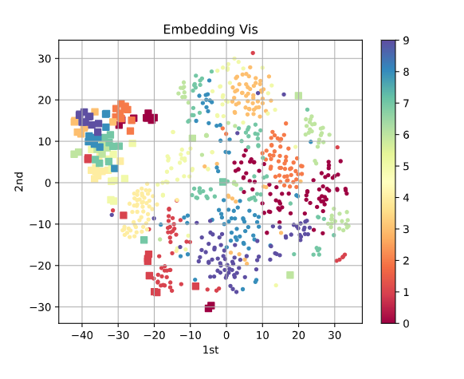

# SketchyDatabase

[](LICENSE)    

# DataSet

Sketchy Database

### Test Set

As I didn't notice that the Sketchy Database contained a list of the testing photos, I randomly chose the testing photos and their related sketches myself. The test data set are listed in [TEST_IMG](test_img.txt) and [TEST_SKETCH](test_sketch.txt)

|   category  | photo | sketch |
|    :---:    | :---: | :---:  |
|   airplane  |   10  |   75   |
| alarm_clock |       |   52   |
|     ant     |       |   53   |
|     .       |       |   .    |
|     .       |       |   .    |
|     .       |       |   .    |
|     window  |       |   54   |
| wine_bottle |       |   52   |
|     zebra   |       |   66   |
|  **Total**  |  1250 |  7875  |

### The Dataset Structure in My Project

```Bash
Dataset
  ├── photo-train               # the training set of photos
  ├── sketch-triplet-train      # the training set of sketches
  ├── photo-test                # the testing set of photos
  ├── sketch-triplet-test       # the testing set of sketches
```
# Test

using [feature_extract.py](https://github.com/CDOTAD/SketchyDatabase/blob/master/feature/feature_extract.py) to get the extracted feature files ('\*.pkl')

using [retrieval_test.py](https://github.com/CDOTAD/SketchyDatabase/blob/master/retrieval_test.py) to get the testing result.

# Testing Result

|                        model                             | epoch | recall@1 | recall@5|
|                        :---:                             | :---: | :---:    | :---:   |
| resnet34(pretrained;mixed training set;metric='cosine')  |        | |                 |
|                                                          |  90   |  8.51%   |  18.68% |
|                                                          |  150  |  9.31%   |  20.44% |
|resnet34(pretrained;mixed training set;metric='euclidean')|       | |                  |
|                                                          |  90   |  6.45%   |  14.79% |
|                                                          |  150  |  6.96%   |  16.46% |
|resnet34(150 epoch;triplet loss m=0.02;metric='euclidean';lr=1e-5 batch_size=16)| | |  |

I have no idea about why the resnet34 got that bad result, while the vgg16 and resnet50 resulted pretty well.


**The boxes represent the photos, while the points represent the sketches.**

|                    model                  |                     vis                   |
|                    :---:                  |                    :---:                  |
|       resnet34 pretrained on ImageNet     ||
|    **pretrained; sketch branch& photo branch are trained sparately**           |
|         resnet34                          || 
|    **pretrained; mixed training set**                                                 |
|      resnet34 after 90 training epoch     |      |
|      resnet34 after 150 training epoch    |     |

# Attention

I just try to train Resnet34 to build a sketchy database, if you would like to learn more, please contact the original author with this link:https://github.com/CDOTAD/SketchyDatabase thankfully!
